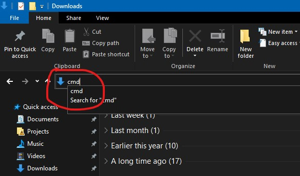

# Cara menginstall simdak

Pastikan [python](https://www.python.org/) terinstall (disarankan menggunakan [python 3.7](https://www.python.org/downloads/release/python-379/))

Buka cmd,

<details> 
  <summary>Cara membuka cmd</summary>
   Buka folder (tempat menyimpan data)
   Ketik cmd di bar alamat
   
   Enter
</details>

Lalu jalankan (ketik & enter) perintah berikut untuk menginstall simdak

```bash
pip install --upgrade simdak
```

Setelah muncul teks `Successfully installed...` berarti simdak sudah berhasil terinstall.
